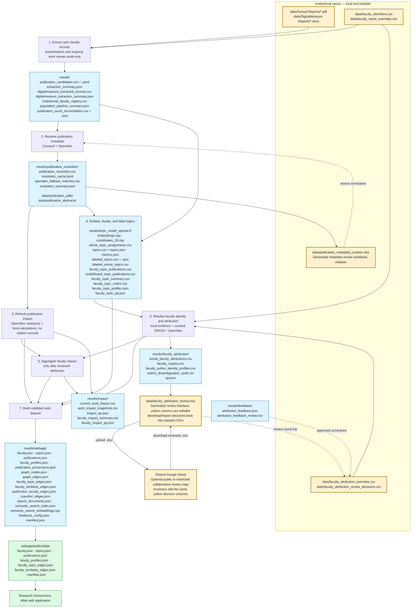

# Research Connections Atlas

A reusable pipeline and web application for turning college publication records into an explorable map of faculty, publications, research themes, and potential intellectual connections.

The repository is designed so a new contributor can clone it, attach the folder to Codex, validate the machine, and begin work without copying another computer's virtual environment, credentials, caches, or chat history.

## Pipeline at a glance



Yellow nodes are human-editable inputs or review interfaces. Blue nodes are reproducible local outputs and should not be edited directly. Green nodes are the generated assets copied into the web application for publication. Raw institutional inputs, downloaded content, review workbooks, and `results/` are ignored by Git; the curated CSV decision files are tracked.

## New-computer quick start

### 1. Clone and enter the repository

```bash
git clone <YOUR-REPOSITORY-URL> research-connections-atlas
cd research-connections-atlas
```

### 2. Install prerequisites

- Git
- Python 3.10 or newer
- [uv](https://docs.astral.sh/uv/) (recommended Python environment manager)
- Node.js 22.13 or newer and npm
- Poppler (`pdftotext`) for PDF annual-report extraction

Then run:

```bash
./scripts/bootstrap.sh
python3 scripts/doctor.py --strict
```

Windows PowerShell users can run:

```powershell
powershell -ExecutionPolicy Bypass -File scripts/bootstrap.ps1
python scripts/doctor.py --strict
```

The bootstrap installs the ordinary Python and web-development dependencies. Topic modeling is deliberately optional because PyTorch and SPECTER2 are large:

```bash
uv sync --extra topic
```

### 3. Open it in Codex

1. Open the ChatGPT desktop app and select **Codex**.
2. Add a local project and select this repository's root folder.
3. Make this folder the project's primary folder.
4. Trust the repository when prompted so Codex can load the checked-in project guidance.
5. Start a new chat with: `Read AGENTS.md and README.md, run the project doctor, and orient me to this repository.`

Codex will automatically use `AGENTS.md` as durable repository guidance. Local chat history is machine-specific; durable decisions belong in Git-tracked documentation, issues, and commits.

## Try the application

After bootstrapping:

```bash
npm --prefix webapp run dev
```

Open the local URL printed by the development server. A complete institutional dataset is generated by the pipeline and copied to `webapp/public/data/`; raw and generated data are intentionally not committed by default.

## Run the data workflow

1. Copy your PDF annual reports into `data/Annual-Reports/`.
2. Copy optional Digital Measures `.docx` exports into `data/DigitalMeasure-Reports/`.
3. Create the local files described in `.env.example` and `docs/DATA_AND_PRIVACY.md`.
4. Run a local, non-network extraction check:

```bash
.venv/bin/python code/run_population_pipeline.py \
  --dry-run --skip-resolution --skip-reconciliation
```

5. Follow [the pipeline guide](code/README.md) for resolution, curation, topic modeling, attribution, and application-data generation.

For a different institution, begin with [Adapting for your college](docs/ADAPTING_FOR_YOUR_COLLEGE.md).

## Common commands

```bash
# Machine and checkout validation
python3 scripts/doctor.py --strict

# Python tests
.venv/bin/python -m unittest discover -s code -p 'test_*.py'

# Web lint, test, build, and development server
npm --prefix webapp run lint
npm --prefix webapp test
npm --prefix webapp run build
npm --prefix webapp run dev
```

## What is and is not shared through Git

Git shares source code, configuration examples, documentation, tests, and reproducible environment definitions. It intentionally excludes credentials, source reports, downloaded publications, model caches, generated results, and local Codex chats.

See [Data and privacy](docs/DATA_AND_PRIVACY.md) before publishing a fork.

## Project status

This is a research workflow, not an authoritative faculty-evaluation system. Metadata resolution, entity attribution, and topic clustering require human review. Similarity connections indicate analytical overlap, not coauthorship, endorsement, or institutional recommendation.

## License

The source code and documentation in this repository are licensed under the
[Apache License 2.0](LICENSE). Institutional source records, publication content,
generated datasets, names, logos, and other third-party materials are not
automatically covered by that license.

## Documentation

- [Pipeline reference](code/README.md)
- [Adapting for your college](docs/ADAPTING_FOR_YOUR_COLLEGE.md)
- [Data and privacy](docs/DATA_AND_PRIVACY.md)
- [Contributing](CONTRIBUTING.md)
- [Codex project guidance](AGENTS.md)
