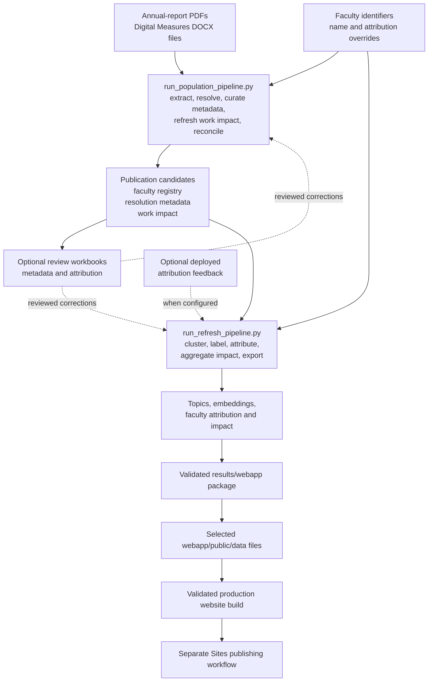

# Scholarly impact pipeline

This directory contains the reproducible data pipeline behind the Research Connections
Atlas. Run commands from the repository root. Generated files under `results/`, local
source reports, downloaded content, and review workbooks are intentionally ignored by
Git; reviewed CSV decisions and source code are tracked.

For the repository-wide architecture, see the larger Mermaid diagram in the root
[`README.md`](../README.md#pipeline-at-a-glance). The diagram below focuses on the two
pipeline entry points and their handoff to the website.

## How the pipeline fits together



The population pipeline establishes the publication corpus and metadata. The refresh
pipeline performs the downstream analyses and prepares the files consumed by the web
application. Neither command deploys the website; deployment is a separate Sites or
hosting-provider action after validation.

## Normal workflow

### 1. Validate the environment

```bash
python3 scripts/doctor.py --strict
```

Install ordinary dependencies with `./scripts/bootstrap.sh`. Install the optional,
larger topic-modeling environment with:

```bash
uv sync --extra topic
```

### 2. Preview extraction changes

This reruns both extractors in temporary staging without changing results or making
network requests:

```bash
.venv/bin/python code/run_population_pipeline.py \
  --mode rebuild \
  --dry-run \
  --skip-resolution \
  --skip-reconciliation \
  --skip-impact-refresh
```

### 3. Populate or update the publication corpus

Use append mode for routine additions. Store the OpenAlex key at the single documented
path `.secrets/openalex_api_key`; never commit it.

```bash
.venv/bin/python code/run_population_pipeline.py \
  --mode append \
  --openalex-api-key-file .secrets/openalex_api_key
```

Use `--mode rebuild` after extraction rules change or source reports are removed. A
rebuild replaces the candidate CSV/JSONL, prunes stale resolver-cache entries, and
re-resolves every current candidate. It can therefore make thousands of network
requests and take substantially longer than append mode.

Useful population flags:

- `--no-download`: resolve metadata without downloading open-access PDFs.
- `--limit N`: limit each resolution or impact pass for a small test run.
- `--skip-resolution`: extract and reconcile without metadata network requests.
- `--skip-openalex-fallback`: omit direct OpenAlex searches for unmatched records.
- `--skip-impact-refresh`: reuse the current publication-impact data.
- `--skip-reconciliation`: omit comparison with annual narrative counts.
- `--dry-run`: stage extraction and report candidate counts without modifying results.

The population pipeline runs, in order:

1. annual-report PDF extraction;
2. Digital Measures extraction and faculty-registry construction;
3. candidate append or rebuild;
4. Crossref resolution and optional OpenAlex fallback;
5. publication metadata curation import, when the workbook exists;
6. optional OpenAlex publication-impact refresh; and
7. publication-count reconciliation.

### 4. Refresh analyses and application data

The default command retrieves configured feedback, imports a local reviewed attribution
workbook when present, applies publication curation, reruns SPECTER2, resolves faculty
attribution, aggregates faculty impact, builds validated web data, copies the seven
runtime JSON files into `webapp/public/data`, and builds the production application.

```bash
.venv/bin/python code/run_refresh_pipeline.py
```

Useful refresh flags:

- `--skip-clustering`: reuse current embeddings and topic assignments.
- `--skip-feedback-fetch`: do not retrieve deployed attribution feedback.
- `--skip-attribution-review-import`: do not import the local reviewed workbook.
- `--skip-app-build`: rebuild data without validating the production web build.
- `--device auto|cpu|mps|cuda`: select the SPECTER2 execution device.
- `--refresh-openalex-impact --openalex-api-key-file .secrets/openalex_api_key`:
  refresh publication impact before faculty aggregation.

Feedback retrieval requires `FEEDBACK_EXPORT_URL` or `.secrets/feedback_export_url`
plus the configured administrator key. When those are not available or feedback should
remain unchanged, pass `--skip-feedback-fetch`.

### 5. Validate and publish the website

The refresh pipeline runs the production build unless `--skip-app-build` is supplied.
Before publishing independently, run:

```bash
npm --prefix webapp run lint
npm --prefix webapp test
```

Publishing to OpenAI Sites or another host is intentionally separate from data
generation. Publish only after `webapp/public/data/manifest.json` and the production
build represent the desired analysis run.

## Output map

### Population outputs

- `results/publication_candidates.csv` and `.jsonl`: resolver-ready source records.
- `results/extraction_summary.json`: annual-report extraction QA.
- `results/digitalmeasure_extracted_records.csv`: all Digital Measures categories,
  including presentations and unfinished work retained for audit only.
- `results/digitalmeasure_extraction_summary.json`: Digital Measures counts and QA.
- `results/institutional_faculty_registry.csv`: stable institutional faculty roster.
- `results/publication_resolution/`: Crossref/OpenAlex results and resumable cache.
- `results/impact/current_work_impact.csv`: current publication-level impact measures.
- `results/impact/work_impact_snapshots.csv`: dated successful impact observations.
- `results/publication_count_reconciliation.csv` and `.json`: annual count comparison.

### Analytical outputs

- `results/topic_model_specter2/`: embeddings, coordinates, topics, labels, assignments,
  faculty-topic summaries, and topic QA.
- `results/faculty_attribution/`: final attributions, identity profiles,
  disambiguation audit, registry, and QA.
- `results/impact/faculty_impact_summary.csv`: corpus-scoped faculty impact calculated
  only after final attribution.
- `results/webapp/`: complete validated entity, graph, search, semantic-index,
  provenance, feedback-contract, and manifest package.

### Published runtime files

`run_refresh_pipeline.py` copies these files into `webapp/public/data/`:

- `faculty.json`
- `topics.json`
- `faculty_profiles.json`
- `faculty_similarity_edges.json`
- `faculty_topic_edges.json`
- `publications.json`
- `manifest.json`

The complete `results/webapp/` package contains additional provenance, graph, search,
and semantic-index artifacts used for validation and supporting services. Coauthor
edges are currently emitted as an empty, reserved dataset; generating coauthor edges
is not yet implemented, even though publication-author identity resolution is.

## Manual stage reference

The orchestration commands above are preferred. Run individual stages when developing,
debugging, or reviewing a specific boundary.

### Annual-report extraction

```bash
.venv/bin/python code/extract_publications.py
```

The extractor reads `data/Annual-Reports/*.pdf`. The 1999 report is image-only and
requires an OCR workflow before it can be extracted. The 1997 text layer should be
manually sampled because its citation boundaries are inconsistent.

### Digital Measures extraction

```bash
.venv/bin/python code/extract_digitalmeasure_publications.py
```

The extractor reads `data/DigitalMeasure-Reports/*.docx`, ignores temporary Microsoft
Office lock files, tracks resume owners and publication subsections, and retains the
complete citation as provenance and the resolver query. Audit categories are `article`,
`book`, `book_chapter`, `presentation`, and `other`.

Records explicitly marked ongoing, submitted, working paper, or reviewed-not-accepted
remain in the audit file but are not sent for external resolution. Presentations are
also audit-only. Use `--replace-digitalmeasure` when directly rerunning this script
against an existing mixed candidate CSV; prefer population `--mode rebuild` after a
material extraction-rule change.

### Metadata resolution and lawful OA retrieval

For a small resumable batch:

```bash
export CROSSREF_MAILTO="you@example.edu"
export UNPAYWALL_EMAIL="you@example.edu"
.venv/bin/python code/resolve_and_download_publications.py \
  --openalex-api-key-file .secrets/openalex_api_key \
  --limit 25
```

Remove `--limit` to continue. Add `--no-download` to resolve metadata without fetching
PDFs. The resolver uses only open-access or license-qualified locations and does not
bypass authentication. Direct OpenAlex fallback for cached unmatched records is:

```bash
.venv/bin/python code/resolve_and_download_publications.py \
  --openalex-api-key-file .secrets/openalex_api_key \
  --openalex-fallback
```

### Publication metadata curation

Generate the review workbook from the current resolution data:

```bash
node code/create_publication_curation_workbook.mjs
```

Reviewers edit only the yellow cells on `Publication Curation`; the hidden baseline is
the comparison source. To apply reviewed differences manually:

```bash
.venv/bin/python code/apply_publication_metadata_curation.py
```

The population and refresh pipelines run the importer automatically. The generated
workbook is ignored and is not the authoritative source for repository history.

### Publication-count reconciliation

```bash
.venv/bin/python code/reconcile_publication_counts.py
```

This compares `Scholarly Papers Published` in `data/Annual Report compilation.xlsx`
with extracted candidate counts. The image-only 1999 report is excluded by default.

### Topic modeling

```bash
.venv/bin/python code/cluster_publications.py
```

The model embeds canonical titles plus abstracts with SPECTER2, reduces the embedding
space with UMAP, discovers topics with HDBSCAN, and extracts c-TF-IDF terms.

### Topic labeling, faculty attribution, impact, and web data

Run these stages in this order when not using `run_refresh_pipeline.py`:

```bash
.venv/bin/python code/label_and_propagate_topics.py --labels-only
.venv/bin/python code/resolve_faculty_attributions.py
.venv/bin/python code/build_faculty_impact_summary.py
.venv/bin/python code/build_webapp_data.py
```

Similarity edges represent possible intellectual overlap, not coauthorship,
endorsement, or an institutional recommendation.

### Faculty attribution review round trip

Generate the review workbook after population and faculty attribution:

```bash
node code/create_faculty_attribution_review_workbook.mjs
```

Upload `data/faculty_attribution_review.xlsx` to Google Sheets if collaborative review
is needed. Reviewers edit only the yellow columns on `Canonical Faculty`, `Attribution
Review`, and `Exceptions`. Download the reviewed workbook to the same path, then run:

```bash
.venv/bin/python code/import_faculty_attribution_review.py --dry-run
.venv/bin/python code/import_faculty_attribution_review.py
```

The importer upserts tracked decisions in
`data/faculty_attribution_review_decisions.csv` and derives the tracked name and
attribution override CSVs. Use `clear` to withdraw a previously imported decision.

### Curated faculty identifiers

Add verified ORCIDs to `data/faculty_identifiers.csv` using stable `faculty_id` values:

```csv
faculty_id,faculty_name,orcid,source,verified_at,notes
fac_example1234567,Jane Q. Scholar,0000-0002-1825-0097,faculty_provided,2026-08-06,
```

ORCIDs are normalized and checksum-validated. Exact curated ORCIDs provide strong
identity evidence but do not independently add unrelated publications to the corpus.

### Publication and faculty impact

Refresh publication-level OpenAlex measures with:

```bash
.venv/bin/python code/refresh_openalex_impact.py \
  --openalex-api-key-file .secrets/openalex_api_key
```

This stores aggregate work measures, not citing-work records or citation edges. It
writes the current work file and appends successful dated observations. Faculty impact
must be aggregated only after final attribution:

```bash
.venv/bin/python code/build_faculty_impact_summary.py
```

The faculty summary reports corpus-scoped measures, including explicitly named
`corpus_h_index` and `corpus_i10_index`; it does not use OpenAlex lifetime-author
totals.

### Live abstract matching service

The deployed atlas's “Match an abstract” feature uses a companion SPECTER2 inference
service. Start it locally with:

```bash
.venv/bin/python code/serve_specter2_matcher.py
```

Configure the website with `SPECTER2_ENDPOINT_URL` ending in `/match`. If the service
uses `SPECTER2_API_TOKEN`, configure the website with the same secret. Submitted
abstracts are processed in memory and are not stored by this service.
